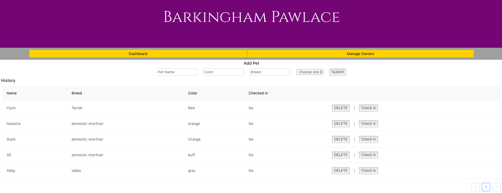

# Pet Hotel

*Duration: 2 Day Sprint*

This group project is centered around a fictional pet hotel, Barkingham Pawlace. The app allows the user to add new owners and pets to the database, and also allows check in/out and delete functionality.

## Screen Shot

## Prerequisites
- Node.js
- Express
- PostgreSQL

## Installation
1. Create a database named `barkingham_pawlace` and add two tables. The `database.sql` file in this project has the queries needed to create these tables.
2. Open your code editor and run an `npm install`
3. Run `npm start` in your terminal
4. Open a second terminal window and run an `npm run client`
5. The previous command will open a browser tab granting you access to the site

## Usage
1. The home page has two tabs: Dashboard and Manage Owners. The page will always default to the Dashboard view.
2. To add a new pet and owner, you will first need to go to the Manage Owners tab. Enter the owner's name and submit. Once added to the list, the owner will be listed as having 0 pets until you add a pet and assign to the owner.
3. On the Dashboard under Add Pet, enter the pet's name, breed, color, and select their owner from the dropdown menu. Once all information has been added, submit.
4. To check a pet into the hotel, click the Check In button. This will update to show the date the pet was checked in. Selecting Check Out will revert the pet back to a "Check In" status of "No".
5. To delete a pet or owner, select the Delete button for that particular row.

## Built With
- React
- Node.js
- Express
- TypeScript
- JavaScript
- Ant Design

## Acknowledgement
Thanks to my cohort team members for helping build this application and providing troubleshooting when I ran into issues.

## Support

Please send issues to aescott87@gmail.com
